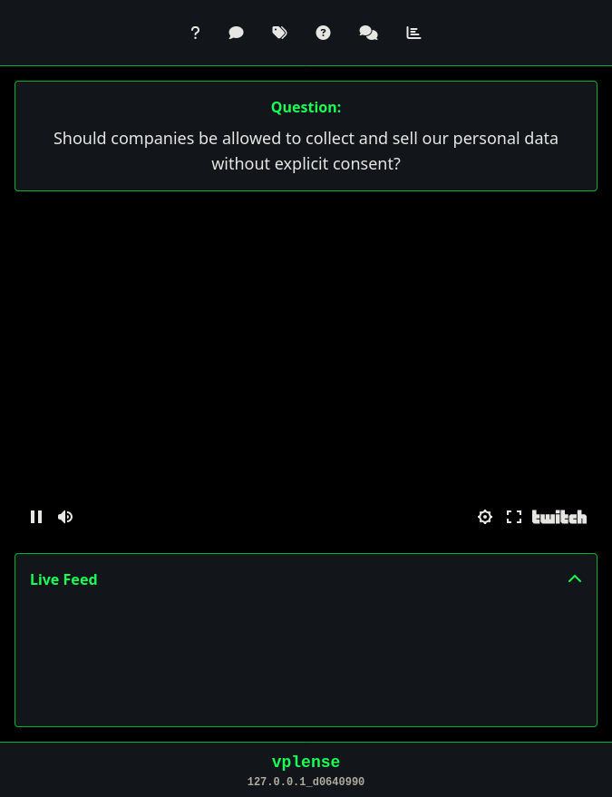

# vpLense - Verified Privacy Lense



**vpLense** is a revolutionary streaming interaction platform that serves as a privacy-focused lens around Twitch, YouTube, and other streaming platforms. It enables anonymous viewer interaction, real-time engagement, and community management while maintaining user privacy and providing powerful tools for content creators.

## 🌟 Overview

vpLense bridges the gap between streamers and their audiences by providing a secure, anonymous interaction layer that enhances viewer engagement without compromising privacy. Users can ask questions, make suggestions, and participate in giveaways while maintaining their anonymity, creating a more inclusive and engaging streaming experience.

## 🔒 Privacy-First Philosophy

- **Anonymous Interaction**: Users can participate without revealing personal information
- **No Account Required**: Immediate access without registration
- **IP-based Protection**: Advanced rate limiting and access control
- **Data Minimization**: Only essential data is collected and stored
- **Transparent Operations**: Open-source and auditable codebase

## ✨ Core Features

### 🎯 Real-Time Interaction System

#### **Questions & Answers**
- **Anonymous Question Submission**: Viewers can ask questions without revealing identity
- **Live Question Display**: Questions appear on screen for streamers to address
- **Moderation Tools**: Streamers can accept, reject, or answer questions in real-time
- **Question History**: Track answered questions for reference

#### **Comments & Suggestions**
- **Instant Feedback**: Viewers can provide comments and suggestions
- **Live Moderation**: Real-time approval/rejection system
- **Comment History**: Maintain records of accepted comments
- **Anonymous Participation**: No personal information required

#### **Topic Management**
- **Stream Topics**: Set and display current discussion topics
- **Dynamic Updates**: Change topics during live streams
- **Topic History**: Track popular and discussed topics

### 🎁 Advanced Giveaway System

#### **Intelligent Prize Distribution**
- **Random Winner Selection**: Fair, algorithm-based winner selection
- **IP-based Limits**: Prevent single users from winning multiple prizes
- **Pay-it-Forward System**: Winners can pass prizes to other viewers
- **Timeout Management**: Automatic handling of unresponsive winners

#### **Flexible Scheduling**
- **Immediate Giveaways**: Start giveaways instantly
- **Scheduled Giveaways**: Set delays (5min, 10min, 30min, 60min)
- **Recurring Giveaways**: Automatic repetition every 5-60 minutes
- **Item Management**: Add/remove prizes dynamically

#### **Winner Experience**
- **Real-time Notifications**: Instant winner selection alerts
- **Accept/Pay Forward**: Winners choose to claim or pass prizes
- **Prize Details**: Secure delivery of prize information
- **Timeout Protection**: Automatic pay-it-forward if no response

### 🛡️ Advanced Admin System

#### **Community Management**
- **Real-time Moderation**: Live approval/rejection of content
- **IP Access Control**: Whitelist/blacklist management
- **Rate Limiting**: Prevent spam and abuse
- **Auto-ACL System**: Automatic access control based on behavior

#### **Analytics & Monitoring**
- **Live Statistics**: Real-time engagement metrics
- **Activity Tracking**: Monitor user participation
- **Rate Limit Monitoring**: Track and manage system load
- **Admin Notifications**: Real-time alerts for important events

#### **System Configuration**
- **Customizable Settings**: Adjust rate limits, timeouts, and behavior
- **Video Source Management**: Switch between streaming platforms
- **Data Management**: Reset and manage system data
- **Security Settings**: Configure access controls and limits

### 🎨 User Interface

#### **Modern Design**
- **Matrix-inspired Theme**: Sleek, professional appearance
- **Mobile Responsive**: Works on all device sizes
- **Real-time Updates**: Live feed of all activities
- **Intuitive Navigation**: Easy-to-use interface

#### **Live Feed System**
- **Real-time Notifications**: Instant updates on all activities
- **Message Types**: Different styling for different event types
- **Collapsible Interface**: Expandable/collapsible live feed
- **Admin Alerts**: Special notifications for administrators

## 🚀 Technical Architecture

### **Backend Technology**
- **Flask**: Lightweight Python web framework
- **Socket.IO**: Real-time bidirectional communication
- **Eventlet**: Asynchronous networking library
- **JSON Storage**: Simple, reliable data persistence

### **Frontend Technology**
- **Vue.js 3**: Modern reactive JavaScript framework
- **Tailwind CSS**: Utility-first CSS framework
- **Font Awesome**: Comprehensive icon library
- **Real-time Updates**: Live synchronization with backend

### **Security Features**
- **Rate Limiting**: Multi-tier protection against abuse
- **IP Management**: Advanced access control system
- **Session Management**: Secure admin authentication
- **Data Validation**: Input sanitization and validation

## 📋 Installation & Setup

### **Prerequisites**
- Python 3.8 or higher
- uv (Fast Python package manager)

### **Quick Start (Development)**

1. **Clone the Repository**
   ```bash
   git clone https://github.com/mrinfinityjs/vplense.git
   cd vplense
   ```

2. **Install uv (if not already installed)**
   ```bash
   curl -LsSf https://astral.sh/uv/install.sh | sh
   # Or on Windows: powershell -c "irm https://astral.sh/uv/install.ps1 | iex"
   ```

3. **Install Dependencies**
   ```bash
   uv pip install -r requirements.txt
   ```

4. **Configure Settings**
   ```bash
   cp config.json.example config.json
   # Edit config.json with your settings
   ```

5. **Run the Application**
   ```bash
   uv run python server.py
   ```

6. **Access the Platform**
   - Open your browser to `http://localhost:5000`
   - Admin login: Use the admin password from config.json

## 🚀 Production Deployment

### **Production Prerequisites**
- Python 3.8+ with uv package manager
- Reverse proxy (Nginx/Apache)
- SSL certificate
- Domain name
- Process manager (PM2/systemd)

### **Production Setup**

1. **Server Preparation**

   **For Debian/Ubuntu:**
   ```bash
   # Update system packages
   sudo apt update && sudo apt upgrade -y
   
   # Install Python and dependencies
   sudo apt install python3 python3-pip python3-venv nginx certbot -y
   ```

   **For Fedora 42:**
   ```bash
   # Update system packages
   sudo dnf update -y
   
   # Install Python and dependencies
   sudo dnf install python3 python3-pip python3-venv nginx certbot -y
   
   # Enable and start nginx
   sudo systemctl enable nginx
   sudo systemctl start nginx
   ```

2. **Install uv and Application Deployment**
   ```bash
   # Install uv (fast Python package manager)
   curl -LsSf https://astral.sh/uv/install.sh | sh
   source $HOME/.cargo/env
   
   # Create application directory
   sudo mkdir -p /opt/vplense
   sudo chown $USER:$USER /opt/vplense
   
   # Clone and setup application
   cd /opt/vplense
   git clone https://github.com/mrinfinityjs/vplense.git .
   
   # Install dependencies with uv
   uv pip install -r requirements.txt
   
   # Copy production config
   cp config.json.example config.json
   ```

3. **Production Configuration**
   ```bash
   # Edit config.json for production
   nano config.json
   ```
   
   ```json
   {
     "app_name": "Your Stream Name",
     "admin_password": "your_very_secure_password_here",
     "rate_limit_global": "100:60",
     "rate_limit_per_ip": "10:60",
     "rate_limit_global_block_for": "300",
     "rate_limit_per_ip_block_for": "300",
     "rate_limit_excessive": "20:3600",
     "rate_limit_excessive_block_for": "3600",
     "auto_whitelist_comments_accepted": "5:3600",
     "auto_whitelist_questions_answered": "3:3600",
     "auto_blacklist_comments_rejected": "5:3600",
     "auto_blacklist_questions_rejected": "5:3600",
     "give_away_max_prize_per_ip": "3:86400",
     "give_away_item_timeout": "60",
     "give_away_max_payitforwards": "5"
   }
   ```

4. **SSL Certificate Setup**
   ```bash
   # Stop nginx temporarily
   sudo systemctl stop nginx
   
   # Get SSL certificate
   sudo certbot certonly --standalone -d yourdomain.com
   
   # Start nginx
   sudo systemctl start nginx
   ```

5. **Nginx Configuration**
   ```bash
   # Create nginx config
   sudo nano /etc/nginx/sites-available/vplense
   ```
   
   ```nginx
   server {
       listen 80;
       server_name yourdomain.com;
       return 301 https://$server_name$request_uri;
   }

   server {
       listen 443 ssl http2;
       server_name yourdomain.com;

       ssl_certificate /etc/letsencrypt/live/yourdomain.com/fullchain.pem;
       ssl_certificate_key /etc/letsencrypt/live/yourdomain.com/privkey.pem;
       ssl_protocols TLSv1.2 TLSv1.3;
       ssl_ciphers ECDHE-RSA-AES256-GCM-SHA512:DHE-RSA-AES256-GCM-SHA512;
       ssl_prefer_server_ciphers off;

       location / {
           proxy_pass http://127.0.0.1:5000;
           proxy_set_header Host $host;
           proxy_set_header X-Real-IP $remote_addr;
           proxy_set_header X-Forwarded-For $proxy_add_x_forwarded_for;
           proxy_set_header X-Forwarded-Proto $scheme;
           
           # WebSocket support
           proxy_http_version 1.1;
           proxy_set_header Upgrade $http_upgrade;
           proxy_set_header Connection "upgrade";
       }

       # Security headers
       add_header X-Frame-Options "SAMEORIGIN" always;
       add_header X-XSS-Protection "1; mode=block" always;
       add_header X-Content-Type-Options "nosniff" always;
       add_header Referrer-Policy "no-referrer-when-downgrade" always;
       add_header Content-Security-Policy "default-src 'self' http: https: data: blob: 'unsafe-inline'" always;
   }
   ```
   
   ```bash
   # Enable site
   sudo ln -s /etc/nginx/sites-available/vplense /etc/nginx/sites-enabled/
   sudo nginx -t
   sudo systemctl reload nginx
   ```

6. **Process Management with PM2**
   ```bash
   # Install PM2
   npm install -g pm2
   
   # Create PM2 ecosystem file
   nano ecosystem.config.js
   ```
   
   ```javascript
   module.exports = {
     apps: [{
       name: 'vplense',
       script: 'server.py',
       interpreter: 'uv',
       interpreter_args: 'run python',
       cwd: '/opt/vplense',
       instances: 1,
       autorestart: true,
       watch: false,
       max_memory_restart: '1G',
       env: {
         NODE_ENV: 'production'
       },
       error_file: '/var/log/vplense/error.log',
       out_file: '/var/log/vplense/out.log',
       log_file: '/var/log/vplense/combined.log',
       time: true
     }]
   }
   ```
   
   ```bash
   # Create log directory
   sudo mkdir -p /var/log/vplense
   sudo chown $USER:$USER /var/log/vplense
   
   # Start application
   pm2 start ecosystem.config.js
   pm2 save
   pm2 startup
   ```

7. **Firewall Configuration**
   ```bash
   # Configure UFW firewall
   sudo ufw allow ssh
   sudo ufw allow 'Nginx Full'
   sudo ufw enable
   ```

8. **Auto-renewal SSL**
   ```bash
   # Test auto-renewal
   sudo certbot renew --dry-run
   
   # Add to crontab
   sudo crontab -e
   # Add: 0 12 * * * /usr/bin/certbot renew --quiet
   ```

### **Production Monitoring**

1. **Log Monitoring**
   ```bash
   # View application logs
   pm2 logs vplense
   
   # View nginx logs
   sudo tail -f /var/log/nginx/access.log
   sudo tail -f /var/log/nginx/error.log
   ```

2. **System Monitoring**
   ```bash
   # Monitor system resources
   htop
   
   # Check disk space
   df -h
   
   # Monitor application status
   pm2 status
   ```

3. **Backup Strategy**
   ```bash
   # Create backup script
   nano backup.sh
   ```
   
   ```bash
   #!/bin/bash
   DATE=$(date +%Y%m%d_%H%M%S)
   BACKUP_DIR="/opt/backups/vplense"
   mkdir -p $BACKUP_DIR
   
   # Backup data directory
   tar -czf $BACKUP_DIR/data_$DATE.tar.gz /opt/vplense/data/
   
   # Backup configuration
   cp /opt/vplense/config.json $BACKUP_DIR/config_$DATE.json
   
   # Keep only last 7 days of backups
   find $BACKUP_DIR -name "*.tar.gz" -mtime +7 -delete
   find $BACKUP_DIR -name "config_*.json" -mtime +7 -delete
   ```
   
   ```bash
   chmod +x backup.sh
   
   # Add to crontab for daily backups
   crontab -e
   # Add: 0 2 * * * /opt/vplense/backup.sh
   ```

### **Production Security Checklist**

- ✅ Strong admin password configured
- ✅ SSL certificate installed and auto-renewing
- ✅ Firewall configured (UFW)
- ✅ Rate limiting configured for production load
- ✅ Security headers added to Nginx
- ✅ Process manager (PM2) configured
- ✅ Log rotation configured
- ✅ Backup strategy implemented
- ✅ Regular security updates scheduled
- ✅ Monitoring and alerting configured

### **Scaling Considerations**

For high-traffic deployments:

1. **Load Balancing**: Use multiple application instances behind a load balancer
2. **Database**: Consider PostgreSQL for high-volume data storage
3. **Caching**: Implement Redis for session management and caching
4. **CDN**: Use CloudFlare or similar for static asset delivery
5. **Monitoring**: Implement comprehensive monitoring (Prometheus, Grafana)

### **Troubleshooting Production Issues**

1. **Application Won't Start**
   ```bash
   # Check logs
   pm2 logs vplense
   
   # Check port availability
   sudo netstat -tulpn | grep :5000
   
   # Restart application
   pm2 restart vplense
   ```

2. **SSL Certificate Issues**
   ```bash
   # Check certificate status
   sudo certbot certificates
   
   # Renew manually if needed
   sudo certbot renew
   ```

3. **Performance Issues**
   ```bash
   # Monitor system resources
   top
   
   # Check nginx status
   sudo systemctl status nginx
   
   # Review application logs
   pm2 logs vplense --lines 100
   ```

4. **uv Installation Issues**
   ```bash
   # Reinstall uv if needed
   curl -LsSf https://astral.sh/uv/install.sh | sh
   source $HOME/.cargo/env
   
   # Verify uv installation
   uv --version
   
   # Reinstall dependencies
   uv pip install -r requirements.txt
   ```

### **Configuration Options**

Edit `config.json` to customize:

```json
{
  "app_name": "vpLense",
  "admin_password": "your_secure_password",
  "rate_limit_global": "30:5",
  "rate_limit_per_ip": "3:30",
  "give_away_max_prize_per_ip": "2:64800",
  "give_away_item_timeout": "30",
  "give_away_max_payitforwards": "3"
}
```

## 🎮 Usage Guide

### **For Viewers**

1. **Access the Platform**: Visit the vpLense URL
2. **Ask Questions**: Use the question interface to submit queries
3. **Make Comments**: Share thoughts and suggestions
4. **Participate in Giveaways**: Enter giveaways when available
5. **Stay Anonymous**: No registration or personal info required

### **For Streamers/Admins**

1. **Login**: Use admin credentials to access management tools
2. **Moderate Content**: Review and approve questions/comments
3. **Manage Giveaways**: Create and manage prize distributions
4. **Monitor Activity**: Watch live feed for real-time updates
5. **Configure Settings**: Adjust system behavior as needed

## 🔧 Advanced Features

### **Giveaway System Details**

#### **Winner Selection Algorithm**
- Random selection from connected users (excluding admins)
- IP-based limits prevent multiple wins per user
- Automatic re-selection if winner is ineligible
- Fair distribution across all participants

#### **Pay-it-Forward Mechanism**
- Winners can choose to pass prizes to others
- Configurable maximum pay-it-forward chains
- Automatic timeout handling
- Real-time notifications for all actions

#### **Scheduling Options**
- **Immediate**: Start giveaways instantly
- **Delayed**: Schedule for 5, 10, 30, or 60 minutes
- **Recurring**: Repeat every 5-60 minutes
- **One-time**: Single execution with item removal

### **Privacy Protection**

#### **Anonymous Interaction**
- No user accounts or personal information required
- IP-based identification for rate limiting only
- No data collection beyond essential functionality
- Automatic data cleanup and management

#### **Access Control**
- Whitelist/blacklist system for IP management
- Automatic access control based on behavior
- Rate limiting to prevent abuse
- Session-based admin authentication

### **Community Management**

#### **Real-time Moderation**
- Live approval/rejection of user content
- Instant feedback and notifications
- Comprehensive activity logging
- Admin-only management tools

#### **Analytics & Monitoring**
- Live statistics and metrics
- User activity tracking
- System performance monitoring
- Detailed admin notifications

## 🛠️ Development & Customization

### **Adding New Features**

The modular architecture makes it easy to extend vpLense:

1. **Backend API**: Add new endpoints in `server.py`
2. **Frontend Interface**: Extend Vue.js components in `templates/index.html`
3. **Real-time Events**: Add Socket.IO events for live updates
4. **Data Models**: Extend JSON storage for new data types

### **Community Management Extensions**

Potential additions for enhanced community management:

- **User Reputation System**: Track user behavior and contributions
- **Moderation Queues**: Advanced content review workflows
- **Analytics Dashboard**: Detailed engagement metrics
- **Custom Integrations**: Connect with streaming platforms
- **Notification Systems**: Email/SMS alerts for admins
- **Content Filtering**: AI-powered content moderation
- **User Roles**: Different permission levels for moderators
- **Event Scheduling**: Plan and manage community events

### **API Documentation**

#### **Core Endpoints**
- `GET /api/questions` - Retrieve pending questions
- `POST /api/questions` - Submit new question
- `GET /api/comments` - Retrieve pending comments
- `POST /api/comments` - Submit new comment
- `GET /api/topics` - Retrieve current topics
- `POST /api/topics` - Add new topic

#### **Admin Endpoints**
- `POST /api/admin/login` - Admin authentication
- `GET /api/admin/config` - Retrieve system configuration
- `POST /api/admin/config` - Update system configuration
- `GET /api/admin/whitelist` - Retrieve IP whitelist
- `POST /api/admin/whitelist` - Add IP to whitelist

#### **Giveaway Endpoints**
- `GET /api/giveaways` - Retrieve all giveaways
- `POST /api/giveaways` - Create new giveaway
- `DELETE /api/giveaways/<id>` - Delete giveaway
- `POST /api/giveaways/<id>/items` - Add item to giveaway
- `POST /api/giveaways/<id>/accept` - Accept giveaway item
- `POST /api/giveaways/<id>/payitforward` - Pay it forward

## 🤝 Contributing

We welcome contributions to vpLense! Here's how you can help:

1. **Fork the Repository**: Create your own fork
2. **Create a Branch**: Make changes in a feature branch
3. **Submit a Pull Request**: Share your improvements
4. **Report Issues**: Help us identify and fix bugs
5. **Suggest Features**: Propose new functionality

### **Development Guidelines**

- Follow Python PEP 8 style guidelines
- Add comments for complex functionality
- Test all new features thoroughly
- Update documentation as needed
- Maintain backward compatibility

## 📄 License

vpLense is released under the MIT License. See `LICENSE` file for details.

## 🆘 Support

- **Documentation**: Check this README and inline code comments
- **Issues**: Report bugs and request features on GitHub
- **Community**: Join our Discord server for discussions
- **Email**: Contact us at support@vplense.com

## 🔮 Roadmap

### **Upcoming Features**
- **Mobile App**: Native iOS and Android applications
- **Streaming Platform Integration**: Direct Twitch/YouTube integration
- **Advanced Analytics**: Detailed engagement metrics
- **AI Moderation**: Automated content filtering
- **Multi-language Support**: Internationalization
- **Custom Themes**: User-customizable interfaces

### **Long-term Vision**
- **Platform Independence**: Work with any streaming service
- **Enterprise Features**: Advanced management tools
- **API Ecosystem**: Third-party integrations
- **Community Marketplace**: Shareable configurations
- **Global Deployment**: Multi-region support

---

**vpLense** - *Verified Privacy Lense* - Bringing privacy and engagement together in the streaming world.

*Built with ❤️ for the streaming community*